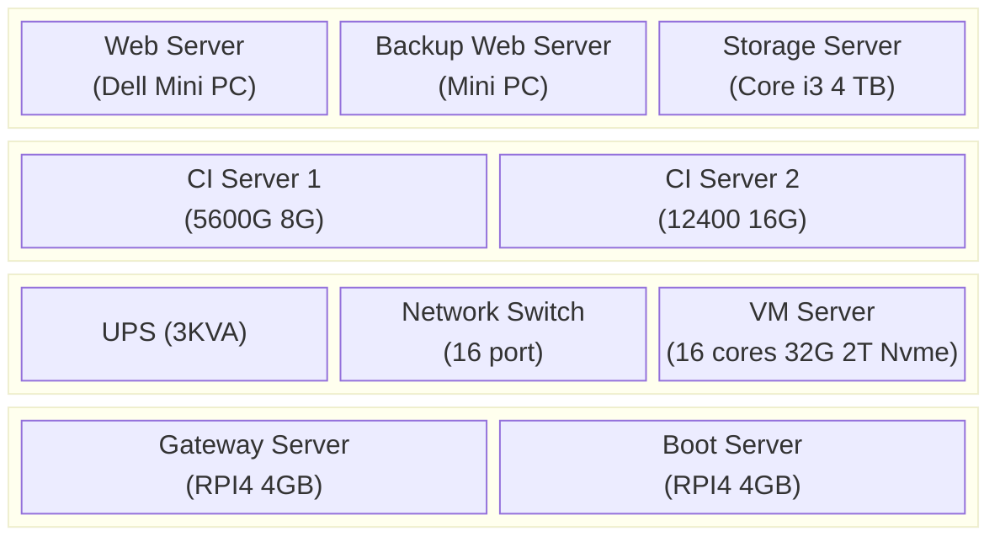

# MyDocs

### [Docker](/Docker.md)
### [Linux](/Linux.md)
### [CMake](/CMake.md)
### [CMake Advanced Usage](/CMake-Advanced-Usage.md)
### [Python](/Python.md)
### [Python Ecosystem](/Python-Ecosystem.md)
### [Python Packaging and Environments](/Python-Packaging-And-Environments.md)
### [Regex](/Regex.md)
### [Git](/Git.md)

### Packaging, Deployment and Recovery
1. Build docker images for each service (web, database, etc.)
2. Spin up wherever you want
3. For system level configs, maintain a config repository and a shell script to automatically configre a bare-metal system
4. Maintain automated backup and restore scripts - test them often
5. Use vagrant in some cases
6. Use Ansible or Terraform if required
7. Decouple runtime from storage/data to enable resuming by restoring the data in a fresh system
8. Document everything.

### Machines Setup
#### Machines we have

#### Configurations
##### Prod. Storage Server (running ubuntu server with zfs)
1. Processor: Core i3 10th Gen - 4 Core 8 threads
2. RAM: 8 GB DDR4
3. Storage:
    1. 4 TB WD UltraStar HDD
    2. 4 TB Seagate IronWolf HDD - Mirror
    3. 500 GB Nvme
##### Prod. Web Servers
###### Web Server 1 (running ubuntu server with docker, public websites)
1. Processor: Core i5 8th gen - 4 Core 4 threads
2. RAM: 8 GB DDR4
3. Storage: 500 GB SSD
###### Web Server 2 (running ubuntu server with docker, internal websites)
1. Processor: Core i5 8th gen
2. RAM: 8 GB DDR4
3. Storage: 500 GB SSD
##### VM Servers (running freebsd with behyve, CI/CD, Prototyping, and Development)
###### Ryzen 9 16 Core 32 threads
1. Processor: [Ryzen 9 5900XT](https://www.amd.com/en/products/processors/desktops/ryzen/5000-series/amd-ryzen-9-5900xt.html)
2. RAM: 32 GB 3200 Mhz
3. Storage: 2 TB Nvme
###### Core i5 6 Core 12 threads
1. Processor: Intel Core i5 12400
2. RAM: 16 GB 32000 Mhz
3. Storage: 500 Nvme
###### Ryzen 5 5600G 6 Core 12 threads
1. Processor: Ryzen 5 5600G
2. RAM: 8 GB 2600 Mhz
3. Storage: 500 Nvme
##### Gateway and DNS server
Raspberry pi 4 4 GB RAM
##### Misc Server (Config repo server, Network Boot Server, Gateway backup server) 
Raspberry pi 4 4 GB RAM
##### UPS
3 KVA, 2700W
##### Infrastructure Router
1 Gigabit Router
##### Network Switch
16-port Gigabit Unmanaged switch
