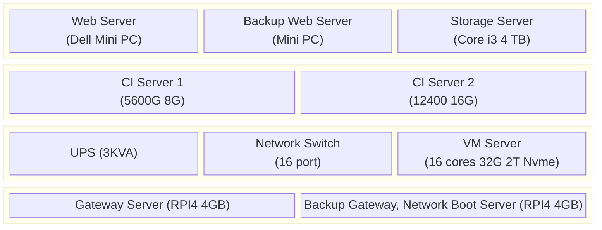

# MyDocs

### [Docker](/Docker.md)
### [Linux](/Linux.md)
### [CMake](/CMake.md)
### [CMake Advanced Usage](/CMake-Advanced-Usage.md)
### [Python](/Python.md)
### [Python Ecosystem](/Python-Ecosystem.md)
### [Python Packaging and Environments](/Python-Packaging-And-Environments.md)
### [Regex](/Regex.md)
### [Git](/Git.md)

### Machines Setup
#### Machines we have

